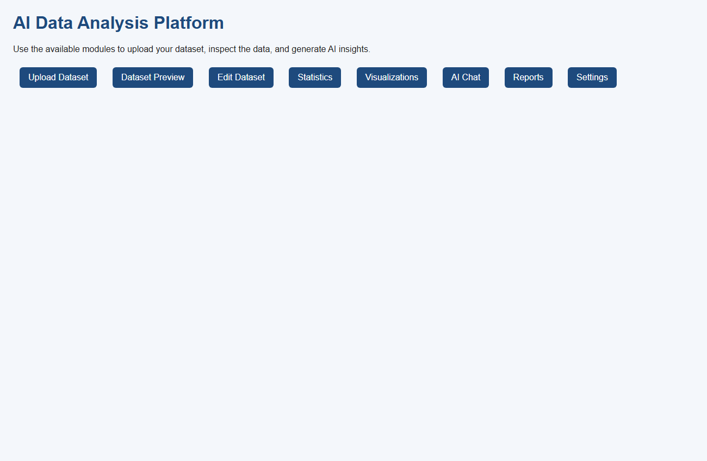

# 📊 AI Data Analysis Platform

AI Data Analysis Platform is a modular data analysis system built with Python and FastAPI. It provides dataset uploading, dataset understanding, AI chat, data cleaning guidance, statistical analysis, visualization recommendations, report generation, and a simple UI.


[Demo](#-demo) · [Features](#features) · [Installation](#installation) · [Running](#running-the-application) · [Project Structure](#project-structure)

## 📽 Demo



## Features

- Dataset upload and preview for CSV, Excel, JSON, TXT, TSV, Parquet
- Dataset understanding with schema, missing value, and correlation analysis
- AI chat agent for natural language dataset questions
- Cleaning suggestions and outlier detection
- Visualization generation with Plotly
- Report generation in HTML format
- Session and dataset metadata tracking using SQLite
- Centralized logging with file and console output

## Installation

1. Create a Python virtual environment:

```bash
python -m venv .venv
```

2. Activate the environment:

- Windows:
  ```bash
  .venv\Scripts\activate
  ```
- macOS/Linux:
  ```bash
  source .venv/bin/activate
  ```

3. Install dependencies:

```bash
pip install -r requirements.txt
```

## Running the application

Start the FastAPI application:

```bash
uvicorn main:app --reload
```

Open the UI in your browser:

```text
http://127.0.0.1:8000/ui/index.html
```

## Project Structure

- `agent/`: AI agent orchestration classes
- `analysis/`: Dataset analysis, cleaning, chat, and statistics modules
- `database/`: SQLite session and dataset metadata storage
- `tools/`: File handling and caching utilities
- `visualization/`: Plot generation and recommendation engines
- `reports/`: Report generation utilities
- `ui/`: Static UI pages
- `utils/`: Configuration, logging, exception handling, and helpers
- `tests/`: Unit and integration tests

## Environment Variables

Use `.env` to configure paths and settings. See `.env.example`.

## Testing

Run unit tests with:

```bash
pytest
```
